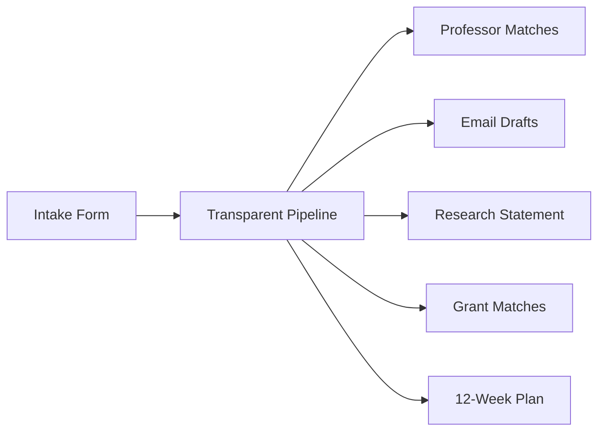

# ResearchBridge

AI-powered research lab entry kit for underrepresented undergraduates.



## Stack

- `apps/web` - React + Tailwind
- `apps/api` - FastAPI + SSE
- `References` - PRD and design references

## Run

```bash
cd apps/api && python3 -m pip install -e . && uvicorn app.main:app --reload
cd apps/web && npm install && npm run dev
```

## Status

Working local product flow: landing, intake, live progress, results dashboard, glossary, history, export.

Live integrations are still seeded adapters for now.
